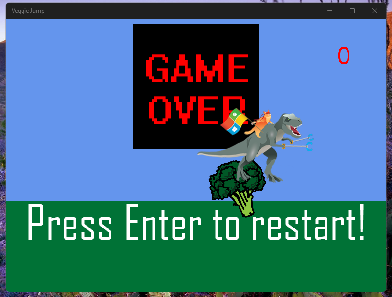
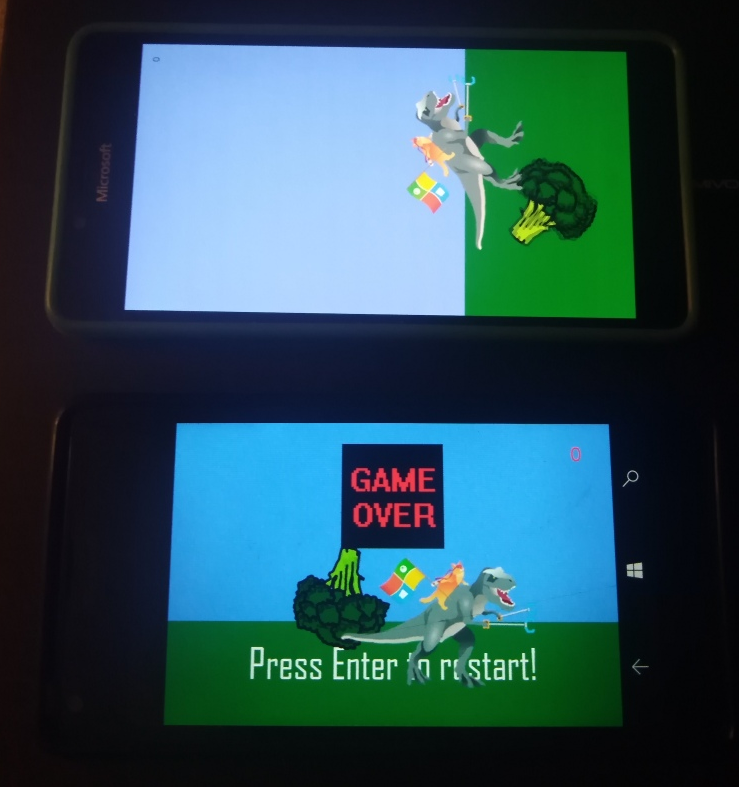

# VeggieJump 1.0.x (MonoGame2D sample)

url: https://github.com/microsoft/windows-appsample-get-started-mg2d/tree/master/
page_type: sample
description: "A sample app accompanying a tutorial that teaches you the basics of game development in MonoGame."
languages: csharp
products: windows 10, windows 10 mobile

## About 
This is my experiment to run Monogame UWP app on/in W10M Astoria :)

## Screenshots

## Features
Min. Win. OS Build descreased to 10240 (Astoria Compatibility)

## Requirements
This app requires Visual Studio 2022 Community to run. [Click here to learn how to get set up with Visual Studio](https://docs.microsoft.com/windows/uwp/get-started/get-set-up).

## Install and run the app
1. Install **MonoGame 3.6** for Visual Studio from [monogame.net](http://www.monogame.net/)
2. Clone or download this repository
3. Open **MonoGame2D.sln** in Visual Studio.
4. To run the app, press **F5**. To quit, press **ESC**.

## Learn more about MonoGame UWP gamedev
For a step-by-step walkthrough of the code, check out the [MonoGame 2D tutorial on docs.microsoft.com](https://web.archive.org/web/20170907085024/https://docs.microsoft.com/en-us/windows/uwp/get-started/get-started-tutorial-game-mg2d).

## ..
As is. No support. For Learning purposes only.

## .
[m][e] 2023
