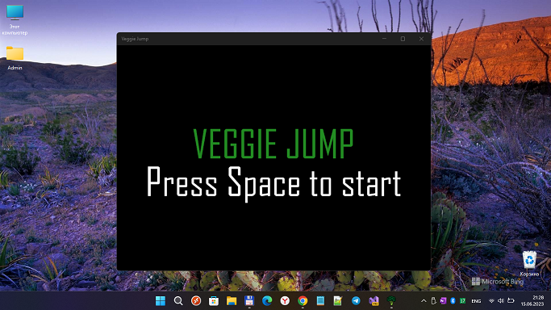

# VeggieJump 1.0.x (MonoGame2D sample)

## About 
This is my experiment to run Monogame UWP app on/in W10M Astoria :)

## Screenshots

## Features
- MonoGame: min. Win. OS Build decreased to 10240 (Astoria Compatibility).
- VeggieJump (MonoGame2D sample): min. Win. OS Build decreased to 10240.
- Mouse control added ("mixed" with keyboard control).
- TouchPanel state parsing added.

## Requirements
This app requires Visual Studio 2022 Community to run. [Click here to learn how to get set up with Visual Studio](https://docs.microsoft.com/windows/uwp/get-started/get-set-up).

## Install and run the app
1. Install **MonoGame 3.6** for Visual Studio from [monogame.net](http://www.monogame.net/)
2. Clone or download this repository
3. Open **VeggieJump.sln** in Visual Studio.
4. To run the app, press **F5**. To quit, press **ESC**.

## Learn more about MonoGame UWP gamedev
For a step-by-step walkthrough of the code, check out the [MonoGame 2D tutorial on docs.microsoft.com](https://web.archive.org/web/20170907085024/https://docs.microsoft.com/en-us/windows/uwp/get-started/get-started-tutorial-game-mg2d).

## References
- https://github.com/microsoft/windows-appsample-get-started-mg2d

## ..
As is. No support. For Learning purposes only.

## .
[m][e] 2023
